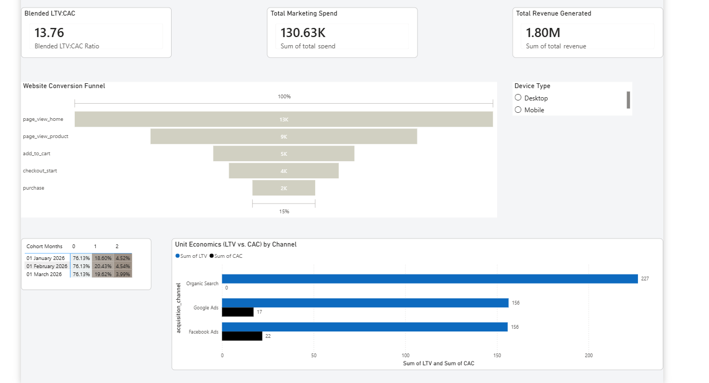

# Customer Retention, Funnel, and Unit Economics Analytics

End-to-end e-commerce analytics engineering project built using MS SQL Server and Power BI. 

This project simulates the micro-data environment of a tech product or e-commerce platform. It focuses on mapping user clickstream journeys, calculating month-over-month cohort retention, and evaluating marketing profitability through unit economics (CAC/LTV).

---

# Executive Summary
This analysis mapped the end-to-end customer journey for Q1 2026, revealing critical insights into conversion bottlenecks and marketing profitability.

* **The Mobile Bottleneck:** Funnel analysis indicates a severe UX friction point during the checkout phase for mobile users. While desktop users convert from checkout-start to purchase at 85%, mobile users drop off drastically, converting at only 35%. **Recommendation:** Immediate audit of the mobile payment UI to reduce cart abandonment.
* **Unit Economics & Channel Strategy:** Organic Search is dramatically outperforming paid channels, yielding a significantly higher Lifetime Value (LTV) at a $0 Customer Acquisition Cost (CAC). **Recommendation:** Reallocate 15-20% of the Q2 ad spend from Google/Facebook into long-term SEO and content strategies to capitalize on this high-retention cohort.

---

# Dashboard Preview

## Executive Analytics Engine



---

# Business Problem

Tech companies and e-commerce platforms live and die by customer retention and acquisition costs. The challenge is transforming raw, unorganized clickstream logs and transactional data into actionable business intelligence capable of:
* Identifying exact drop-off points in the website conversion funnel.
* Tracking user retention over time (Cohort Analysis).
* Determining the exact profitability of different marketing channels (Google Ads vs. Facebook Ads vs. Organic).

This project proves the ability to handle internal micro-data, customer psychology, and operational bottlenecks by building a highly scalable MS SQL to Power BI pipeline.

---

# Technology Stack

| Component | Technology |
|---|---|
| Database | Microsoft SQL Server 2022 |
| Analytics Engine | Advanced T-SQL |
| Visualization | Microsoft Power BI Desktop |
| Version Control | Git & GitHub |
| Semantic Layer | DAX |

---

# Dataset Information (Synthetic Engineering)

Instead of relying on static CSV files, this project features a **custom-engineered, set-based T-SQL generation script** that instantly populates a production-scale database.

* **Scale:** 110,000+ total rows
* **Users:** 10,000 unique profiles
* **Transactions:** 15,000+ orders
* **Event Logs:** 85,000+ sequential clickstream events
* **Engineered Logic:** The dataset intentionally includes realistic business trends (e.g., mobile checkout drop-offs, varying LTV by channel) to simulate a real-world discovery process.

---

# Database Architecture

The project follows a clean, optimized layered architecture.

## 1. Physical Data Layer (Star Schema)
* `users` (Dimension): Core attributes and acquisition channels.
* `clickstream_events` (Fact): Sequential website journey logs.
* `orders` (Fact): Transactional revenue data.
* `marketing_spend` (Fact): Daily ad spend for CAC calculation.

## 2. Semantic View Layer
* **Funnel View:** Utilizes `LAG` and `LEAD` window functions to track individual session IDs across timestamps.
* **Cohort View:** Calculates "Acquisition Month" via `DATEFROMPARTS` and maps subsequent retention decay using `DATEDIFF`.
* **Unit Economics View:** Aggregates multi-table spend vs. revenue to output pure CAC, LTV, and Ratio metrics.

---

# SQL Concepts Demonstrated

* Set-Based High-Volume Data Generation (Tally Tables / Cross Joins)
* Advanced Window Functions (`LEAD`, `OVER`, `PARTITION BY`)
* Date/Time Manipulation (`DATEDIFF`, `DATEFROMPARTS`)
* Common Table Expressions (CTEs)
* `CROSS APPLY` for dynamic logic scaling
* Failsafe aggregation (`ISNULL`, `NULLIF` to prevent zero-division)

---

# Power BI Dashboard Features

* **Minimalist UI:** Designed with a "Simple Luxury" aesthetic focusing on a high data-ink ratio.
* **Dynamic Slicing:** Funnel shapes immediately respond to categorical slicing (e.g., Device Type).
* **Matrix Heatmap:** Month-over-month cohort retention visualized via automated gradient conditional formatting.
* **Centralized DAX Measure Group:** All business logic (`Retention %`, `Total Sessions`, `Blended LTV:CAC`) housed in a dedicated `_Key_Measures_Table` for enterprise model hygiene.

---

# Project Structure

```text
customer-retention-unit-economics/
│
├── dashboard.png
├── README.md
│
├── docs/
│
├── powerbi/
│   └── dashboard.pbix
│
└── sql/
    ├── 01_schema_and_mock_data.sql
    └── 02_analytical_views.sql
```

---

# Data Setup Instructions

## Step 1 — Build the Engine
Open your MS SQL Server environment (SSMS or Azure Data Studio) and execute the files in this strict order:

1. Run `sql/01_schema_and_mock_data.sql` to generate the `EcommerceLifecycleDB` database, build the tables, and instantly populate the 110,000+ synthetic records.
2. Run `sql/02_analytical_views.sql` to build the advanced window functions and cohort grouping views.

## Step 2 — Connect the Visualization
1. Open `powerbi/dashboard.pbix`.
2. If prompted, update the SQL Server Data Source Settings to point to your local server instance.
3. The dashboard will instantly refresh with the custom data.

---

# Author

## Darshan Tada
* **GitHub:** [Darshantada10](https://github.com/Darshantada10)
* **LinkedIn:** [Darshan Tada](https://linkedin.com/in/darshantada)
* **Email:** darshantadaofficial@gmail.com